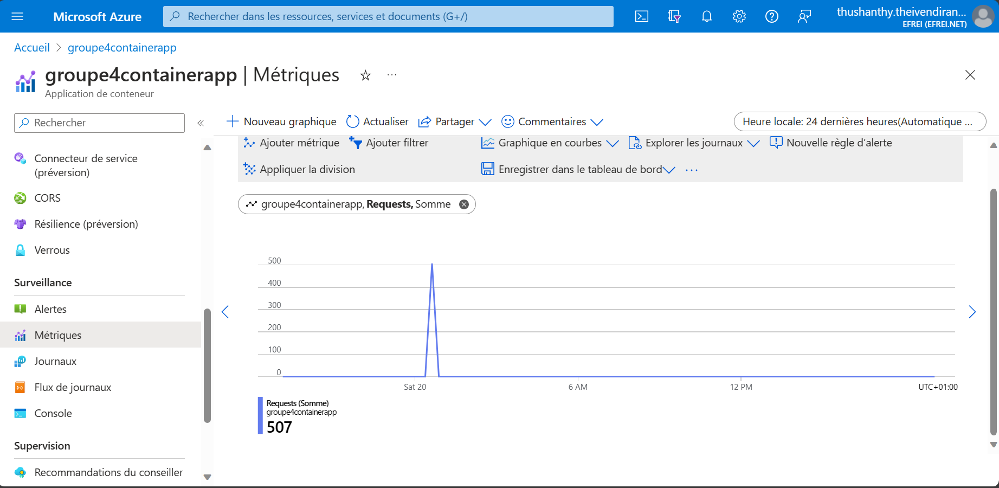

# Applications of Big Data  - Projet 


<image src="images/banner.png" width=1000 center>

                     [](https://hub.docker.com/r/hadolint/hadolint) 
[]()   [](https://www.docker.com/)           [](https://www.docker.com/)
[](https://hub.docker.com/r/prom/prometheus/tags)
[](https://hub.docker.com/r/grafana/grafana/tags)
[](https://flask.palletsprojects.com/en/3.0.x/)
[](https://scikit-learn.org/stable/)

***
***

## **Groupe 4** :

- #### Frimpong ADOTRI
- #### Suvéta ANANDARAJ
- #### Abisha JEYAVEL 
- #### Thushanthy THEIVENDIRAN
- #### Augusta Merveille TSAMPI MEZAGUE 

<br/>

---
---
## 1. Objectif du projet : 

Déployer, à travers d'une API, un modèle entraîné de prédiction en utilisant la philosophie
DevOps sur un fournisseur de services cloud.

<br/>

***
---
## 2. Entrainement d'un modèle de KNN sur le dataset iris

**Source des données** : https://raw.githubusercontent.com/frimpong-adotri-01/datasets/main/iris_dataset.csv

**Notebook de training** : `model_training.ipynb`

Nous avons procédé au preprocessing des données (Normalisation, splitting en train et test sets, encding des variables qualitatives) dans un premier temps. Ensuite, nous avons entraîné le modèle de KNN avec le paramètre `n_neighbors=3`. L'accuracy de ce modèle était plutôt satisfaisant (Accuracy $\simeq 0.97$).<br/>
Cependant, afin d'améliorer le modèle, une cross-validation nous aidera à déterminer la valeur optimale du paramètre `n_neighbors`. On note la valeur optimale de `n_neighbors` comme 6 et on ré-entraîne le modèle avec cette valeur. Les résultats sont aussi satisfaissants : 
- Accuracy $\simeq 0.97$
- Precision $\simeq 0.97$
- Recall $\simeq 0.97$

Ce modèle est sauvegardé dans le fichier `iris_model.pkl` et servira de modèle de prédiction pour l'API REST.


<br/>

***
---
## 3. Code Python `modelApi.py`

Le but de ce script est de développer un serveur web utilisant Flask. Ce serveur a pour but de déployer le modèle de prédiction de classification d'espèces d'Iris via une API REST. 

Le code intègre aussi des métriques de suivi, utilisant Prometheus pour mesurer les statistiques liées aux prédictions et aux performances du serveur. 

Voici les métriques Prometheus définis : 

- `python_request_operations_total` : Le nombre total de requetes traitées
- `python_processing_time_seconds` : Temps de traitement de chaque prédiction
- `python_iris_virginica_predictions_total` : Le nombre total de prédictions Iris-virginica
- `python_iris_setosa_predictions_total` : Le nombre total de prédictions Iris-setosa
- `python_iris_versicolor_predictions_total` : Le nombre total de prédictions Iris-versicolor

<br/>

Dans ce script, on définit deux endpoints : 

- ```/predict``` pour effectuer des prédictions en utilisant le modèle entrainé dans le notebook **model_training.ipynb**
- ```/metrics``` pour exposer les métriques Prometheus. Il renvoie les métriques au format texte/plain. 

<br/>

---
## 4. Dockerfile : Fichier de configuration 
---

Dockerfile permet de configurer et créer rapidement une image Docker. Dans le Dockerfile, on écrit les instructions décrivant les actions que l’image Docker doit exécuter une fois qu’elle sera créée.

Voici les instructions pour notre image Docker :


```dockerfile
FROM python:3.11-slim-bookworm
```

<br/>

- Notre image Docker va être construite à partir de l'image de ```python:3.11-slim-bookworm```. Cette image ne comporte aucune vulnérabilité (cliquez [ici](https://hub.docker.com/layers/library/python/3.11-slim-bookworm/images/sha256-52cf1e24d0baa095fd8137e69a13042442d40590f03930388df49fe4ecb8ebdb?context=explore))

<br/>

```dockerfile
WORKDIR /app
```

<br/>

- On définit le dossier de travail pour les autres commandes comme RUN, CMD.

<br/>

```dockerfile
COPY iris_model.pkl /app
COPY modelApi.py /app
COPY requirements.txt /app
```

<br/>

- On copie le fichier **iris_model.pkl**, **modelApi.py** et **requirements.txt** dans le conteneur Docker à partir de notre machine. 

<br/>

```dockerfile
RUN pip install --no-cache-dir --requirement requirements.txt
```

<br/>

- On lance la commande pour installer les librairies définis dans le **requirements.txt**. 

<br/>

```dockerfile
CMD ["python", "modelApi.py"]
```

<br/>

- La commande **CMD​** spécifie l'instruction qui doit être exécutée au démarrage du conteneur Docker. On exécute la commande ```python modelApi.py``` en mode shell. 

<br/>

***
---
## 5. Configuration de Github Action

Dans ```.github/workflows```, on crée le fichier de workflow ```docker-image.yml```. 


```yaml
on:
  push:
    branches:
      - main
```

<br/>

- Le workflow s'exécute quand on fait un ```push``` sur la branche ```main``` du dépôt Github. 

- Dans ```jobs```, on regroupe toutes les jobs, qui doivent être exécutées dans notre workflow. 

- Dans ```steps```, on définit les étapes de notre workflow : 

    <br/>

    - **1ère étape** : ```Checkout GitHub Action``` : En utilisant l'action **actions/checkout@main**, on récupére notre code source 
   
   <br/>

    ```yaml
    name: 'Checkout GitHub Action'
    uses: actions/checkout@main
    ```

    <br/>

    - **2ème étape** : ```Hadolint for check the code``` : En utilisant l'action **hadolint/hadolint-action@v3.1.0**, on vérifie la conformité du **Dockerfile** avec les pratiques définies par Hadolint
   
   <br/>

    ```yaml
    name: 'Hadolint for check the code' 
    uses: hadolint/hadolint-action@v3.1.0
    with:
        dockerfile: ./Dockerfile 
    ```

    <br/>

    - **3ème étape** : ```Login via Azure CLI``` : Avec l'action **azure/login@v1**, on se connecte à Azure CLI en utilisant la variable AZURE_CREDENTIALS stockée dans les secrets GitHub.

    <br/>
   
    ```yaml
    name: 'Login via Azure CLI'
    uses: azure/login@v1
    with:
        creds: ${{ secrets.AZURE_CREDENTIALS }}
        version: '2022-11-01-preview'
    ```

    <br/>

    - **4ème étape** : ```Create Container App Environment``` : En utilisant la commande Azure CLI, on crée un environnement d'application conteneurisée avec des paramètres tels que le groupe de ressources, le nom, et l'emplacement.

    <br/>
   
    ```yaml
    name: 'Create Container App Environment'
    run: |
    az containerapp env create \
        -g ${{ secrets.RESOURCE_GROUP }} \
        -n groupe4containerapp-bis \
        --location 'france central'
    ```

    <br/>

    - **5ème étape** : ```Build and push image``` : Avec l'action **azure/login@v1**, on se connecte au registre Docker sur Azure avec les informations d'identification stockées dans les secrets GitHub. Puis, on construit l'image Docker à partir du **Dockerfile** avec la commande ```docker build```. Puis, on publie l'image Docker dans le registre Azure avec la commande ```docker push```.

    <br/>
   
    ```yaml
    name: 'Build and push image'
    uses: azure/docker-login@v1
    with:
        login-server: ${{ secrets.REGISTRY_LOGIN_SERVER }}
        username: ${{ secrets.REGISTRY_USERNAME }}
        password: ${{ secrets.REGISTRY_PASSWORD }}
    run: |
        docker build . -t ${{ secrets.REGISTRY_LOGIN_SERVER }}/projetirisgroupe4:${{ github.sha }}
        docker push ${{ secrets.REGISTRY_LOGIN_SERVER }}/projetirisgroupe4:${{ github.sha }}
    ```

    <br/>

    - **6ème étape** : ```Build and deploy Container App``` : En utilisant l'action **azure/container-apps-deploy-action@v1**, on déploie l'application conteneurisée sur Azure Container Apps. 

    <br/>
   
    ```yaml
    name: Build and deploy Container App
    uses: azure/container-apps-deploy-action@v1
    with:
        acrName: efreibigdata           
        containerAppName: groupe4containerapp
        containerAppEnvironment : groupe4containerapp-bis
        resourceGroup: ${{ secrets.RESOURCE_GROUP }}
        imageToDeploy: ${{ secrets.REGISTRY_LOGIN_SERVER }}/projetirisgroupe4:${{ github.sha }}
        location: 'france central'
        targetPort: 8081
        registryUsername: ${{ secrets.REGISTRY_USERNAME }}
        registryPassword: ${{ secrets.REGISTRY_PASSWORD }}
        acrUsername: ${{ secrets.REGISTRY_USERNAME }}
        acrPassword: ${{ secrets.REGISTRY_PASSWORD }}
        azureCredentials : ${{ secrets.AZURE_CREDENTIALS }}
    ```

    <br/>

    - **7ème étape** : ```Configure autoscaling``` : En utilisant la commande Azure CLI, on configure l'autoscaling de l'application conteneurisée. Cette règle d'autoscaling est basée sur la concurrence HTTP. On spécifie que l'on déclenche l'autoscaling dès que le nombre de requêtes simultanées atteint ou dépasse 5. 
   
    ```yaml
    name: Configure autoscaling
        run: |
        az extension add --name containerapp
        az containerapp update \
            --name groupe4containerapp \
            --resource-group ${{ secrets.RESOURCE_GROUP }} \
            --scale-rule-name http-scale-rule \
            --scale-rule-http-concurrency 5 
    ```

<br/>

***
---
## 6. Test de charge avec Locust

Locust est un outil de test de charge qui se base sur un fichier spécifique appélé **locustfile.py**. Ce fichier permet de définir les actions que les simulateurs doit exécuter. Il doit être inclus dans le répertoire courant à partir duquel le daemon locust sera lancé. Le contenu de notre locustfile est le suivant :

```python
from locust import HttpUser, task

class SimulatedUser(HttpUser):
    @task
    def hello_world(self):
        self.client.get("/predict?sepL=5.1&petL=1.4&sepW=3.5&petW=0.1",name="/predict1")  # simulateur1
        self.client.get("/predict?sepL=6.4&petL=5.3&sepW=2.3&petW=3.2",name="/predict2")  # simulateur2
        self.client.get("/predict?sepL=5.1&petL=1.4&sepW=3.5&petW=0.1",name="/predict3")  # simulateur3
        self.client.get("/predict?sepL=5.1&petL=1.4&sepW=3.5&petW=0.1",name="/predict4")  # simulateur4
```

On définit 4 simulateurs différents qui simuleront des envois de requêtes à l'endpoint `/predict`. Ensuite on lance le daemon locust avec la commande suivante:

```sh
$ locust --modern-ui -H "<HOSTNAME>"
```
\<HOSTNAME\> correspond au nom d'hôte de l'application cible (il peut s'agir d'une URL ou d'un nom de domaine. Exemple : `http://localhost:8081`).

Pour accéder à l'interface graphique de locust, il faut entrer dans un navigateur: `localhost:8089`. Le **"Number of users"** est réparti parmi les 4 simulateurs (ils se dupliquent pour atteindre le nombre total). Le **"Ramp Up"** est le multiplicateur d'incrémentation du nombre d'utilisateurs simultanés par secondes. Les **"RPS (Requests per Second)"** correspondent au nombre de requêtes réussies par seconde et les **"Failure/s"** correspondent au nombre de requêtes échouées par seconde. Les **"Failure/s"** augmentent un certain temps avant de s'annuler. Ceci est dû au fait que les réplicats du container sont en cours de création. Un fois crées, ils permettent de supporter la charge des requêtes simultanées, ce qui a pour effet d'annuler le nombre de requêtes échouées.

</img>

À la fin de la simulation, l'utilisateur peut générer un rapport statistique en HTML à télécharger. Ce rapport résume tous les événements de simulation.

<br/>

***
---
## 7. Configuration de `docker-compose.yaml`

Voici le contenu de `docker-compose.yaml` :

```yaml
version: '3'

networks:
  iris-api-net:
    driver: bridge

services:

  iris-api:
    build: 
      context: .
      dockerfile: Dockerfile
    ports:
      - "8081:8081"
    networks:
      - iris-api-net

  prometheus:
    image: prom/prometheus:latest
    ports:
      - "9090:9090"
    networks:
      - iris-api-net
    environment:
      - TZ=Europe/Paris
    volumes:
      - ./prometheus:/etc/prometheus
      - prometheus_data:/prometheus
    command: --web.enable-lifecycle --config.file=/etc/prometheus/prometheus.yaml


  grafana:
    image: grafana/grafana:latest
    ports:
      - "3000:3000"
    networks:
      - iris-api-net
    env_file:
        - .env
    volumes:
      - ./grafana:/var/lib/grafana
      - ./grafana-provisioning:/etc/grafana/provisioning
      - grafana_data:/var/lib/grafana


volumes:
  prometheus_data:
  grafana_data:
```

Dans ce fichier de configuration, nous définissons un réseau Docker et 3 conteneurs.
#### Réseau : 
- `iris-api-network` : ce réseau est de type bridge et permet la communication entre les différents services qui vont être créés.

#### Services : 
- `iris-api` : cette image est construite à partir du Dockerfile et elle permet d'exécuter notre API dans le port 8081.
- `prometheus` : ce conteneur est créé à partir de l'image `prom/prometheus:latest`. Il s'expose au port 9090. On définit une variable d'environnement pour le fuseau horaire. 
- `grafana` : le conteneur `grafana` s'appuie sur l'image `grafana/grafana:latest`. Il utilise les variables d'environnement, initiées dans le fichier `.env`, qui seront utilisées pour l'authentification dans Grafana. <br/>
Voici  le contenu du fichier `.env` (l'utilisateur doit choisir un identifiant et un mot de passe qui lui sont propres)
```ini
GF_SECURITY_ADMIN_PASSWORD=xxxxxxxxxx
GF_SECURITY_ADMIN_USER=xxxxxxxxxx
```

#### Volumes : 
Les volumes `prometheus_data` et `grafana_data` ont été créés pour stocker les données de prometheus et grafana.

<br/>

---
## 8. Configuration de `prometheus.yaml`

```yaml
global:
  scrape_interval: 15s
  scrape_timeout: 10s

scrape_configs:
  - job_name: 'services'
    metrics_path: '/metrics'
    static_configs:
      - targets: ['prometheus:9090', 'iris-api:8081']

# scrapper les métriques de l'Azure container app
  - job_name: 'azure-container-app'
    metrics_path: '/metrics'
    static_configs:
      - targets: ['groupe4containerapp.thankfulrock-b2d0d37a.francecentral.azurecontainerapps.io']  #azure container application URL
```

Ce fichier de configuration de Prometheus est utilisé pour scrapper les métriques à partir de differents services. Il scrape toutes les 15 secondes. On a définit un délai d'attente de 10 secondes. Si le scrapping prend plus de 10 secondes , il sera interrompu.
<br/>
On définit 2 jobs pour le scrapping. En fonction de la cible, on précise l'URL dans la balise `targets`.

<br/>
Un aperçu de l'interface de Prometheus:

</img>

<br/>

***
---
## 9. Grafana

Un aperçu de l'interface de Grafana:

</img>

<br/>

***
---
## 10. Test

Pour tester notre application (Test en local):

- **Étape 1 :** créer un environnement virtuel
  ```sh
  $ python3 -m venv venv
  ```

- **Étape 2 :** lancer l'environnement virtuel
  ```sh
  $ source venv/bin/activate
  ```

- **Étape 3 :** Installer **locust**
  ```sh
  $ pip install locust==2.20.1
  ```

- **Étape 4 :** Lancer la stack Docker
  ```sh
  $ docker-compose up
  ```

- **Étape 5 :** Exécuter une requête vers l'API REST
  ```sh
  #Example
  $ curl "http://localhost:8081/predict?sepL=5.1&petL=1.4&sepW=3.5&petW=0.1"
  ```

- **Étape 6 :** Récuperer les métriques voulues de l'API REST 
  ```sh
  $ curl "http://localhost:8081/metrics"
  ```

- **Étape 7 :** Visualiser les métriques sur Grafana en connectant Grafana à Prometheus et en exécutant de requêtes PromQL

- **Étape 8 (Optionnel):** Lancer le daemon locust pour le test de charge
  ```sh
  $ locust --modern-ui -H "<HOSTNAME>"
  ```

<br/>

</img>

On peut également visualiser le nombre de requêtes envoyés sur l'API (lors du test de charge) via le portail Azure.

<br/>

</img>

<br/>

***
---
## 11. Partie Bonus

- Utilisation d'un linter pour Dockerfile dans la pipeline de déploiement pour s'assurer de sa cohérence. <br/>
À l'exécution de la commande suivante, on a 0 lint erreurs sur notre Dockerfile. 

```sh
$ docker run --rm -i hadolint/hadolint < Dockerfile
```

- Ajout d'un endpoint ```/metrics``` en utilisant la bibliothèque prometheus-client , exposant 5 métriques Prometheus définis. 

- Branchement de Prometheus à Grafana

- Notre image docker de référence `python:3.11-slim-bookworm` ne comporte aucune vulnérabilité  (cliquez [ici](https://hub.docker.com/layers/library/python/3.11-slim-bookworm/images/sha256-52cf1e24d0baa095fd8137e69a13042442d40590f03930388df49fe4ecb8ebdb?context=explore)).


## 12. Problèmes rencontrés

- Difficultés rencontrées pour la configuration du github action, en particulier pour la configuration de l'autoscaling (plusieurs possibilités de configuration, utilisant l'extension `containerapp` ou directement Azure CLI) 
- Difficultés pour connecter l'API à Prometheus dû au mauvais paramétrage du fichier prometheus.yaml